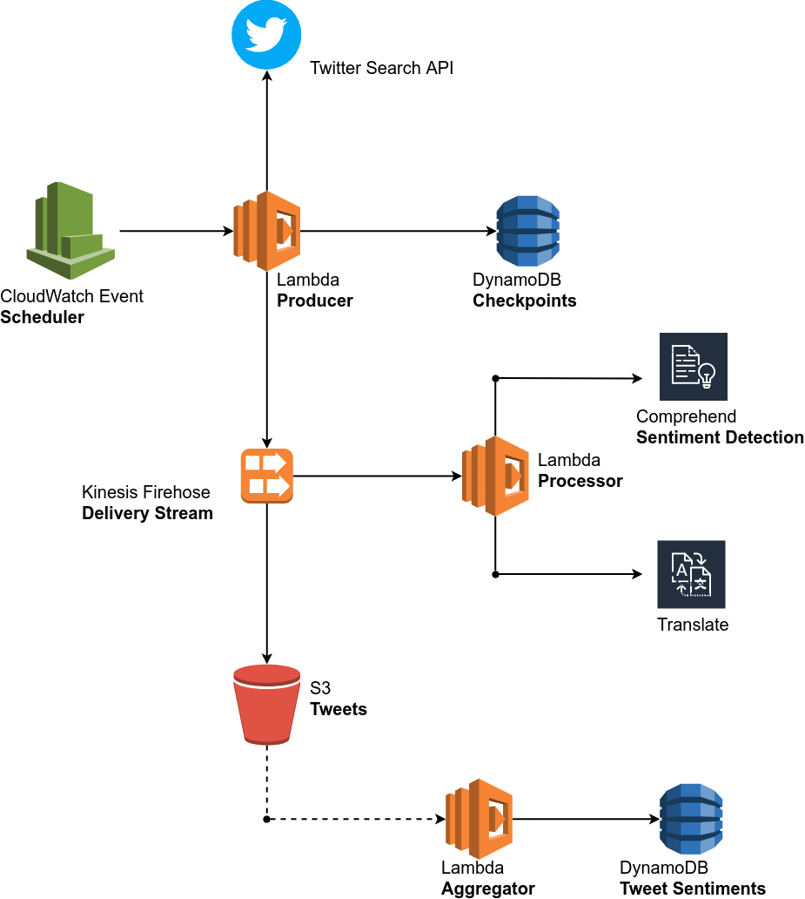

# Tweet Sentiment for AWS CDK

This is an [AWS CDK](https://awslabs.github.io/aws-cdk/) library that allows
you to search for terms in tweets and detect the sentiment in the search
results.

It works by periodically polling the freely available public
[Twitter Standard Search API](https://developer.twitter.com/en/docs/tweets/search/api-reference/get-search-tweets.html)
for the given search terms and feeding the tweets in a stream for analysis and
aggregation.

The result is exposed as a DynamoDB table. Essentially, the table contains one
item per term with the breakdown of tweets per sentiment.

```bash
$ aws dynamodb scan --table-name CdkSampleAppStack-TweetSentimentB1251CEC-LNLOYTJ6H5JB | jq '.Items'
[
  {
    "MIXED": {
      "N": "1"
    },
    "POSITIVE": {
      "N": "85"
    },
    "term": {
      "S": "#hate"
    },
    "NEUTRAL": {
      "N": "1043"
    },
    "NEGATIVE": {
      "N": "94"
    }
  },
  {
    "POSITIVE": {
      "N": "198"
    },
    "term": {
      "S": "#peace"
    },
    "NEUTRAL": {
      "N": "798"
    },
    "NEGATIVE": {
      "N": "7"
    }
  },
  {
    "POSITIVE": {
      "N": "276"
    },
    "term": {
      "S": "#love"
    },
    "NEUTRAL": {
      "N": "733"
    },
    "NEGATIVE": {
      "N": "7"
    }
  }
]
```

## Usage

Create an AWS CDK project and install the `npm` package.

    npm install cdk-tweet-sentiment

Add the `CdkTweetSentiment` construct to your stack.

```ts
import  { CdkTweetSentiment } from 'cdk-tweet-sentiment';

...
new CdkTweetSentiment(this, 'TweetSentiment', {
  /**
   * A comma-separated list of terms to query Twitter.
   */
  terms: '#love, #peace, #hate',

  /**
   * The number of tweets to return per page, up to a maximum of 100.
   * Set to 0 to disable polling.
   * @default 50
   */
  batchSize: 50,

  /**
   * The maximum number of tweets to process per term in every execution.
   * @default 500
   */
  maxTweetsPerTerm: 500,

  /**
   * The frequency, in minutes, that determines when the producer is invoked.
   * Set to 0 to disable polling.
   * @default 5
   */
  interval: 5,

  /**
   * The Twitter developer credentials for application-only authentication,
   * as documented at https://developer.twitter.com/en/docs/basics/authentication/overview.
   */
  twitterCredentials: {
    /**
     * The Twitter consumer key.
     */
    consumerKey: 'xxx',

    /**
     * The Twitter consumer secret.
     */
    consumerSecret: 'xxx',

    /**
     * The Twitter bearer token.
     */
    bearerToken: 'xxx'
  }
});
...
```

Note that `CdkTweetSentiment` is essentially a `@aws-cdk/aws-dynamodb.Table`
object and can be used as such.

[Here](packages/cdk-sample-app) you can find a self-contained CDK application
that uses this construct.

## Architecture



1. A CloudWatch Event Rule triggers the producer lambda function periodically.
2. The last received tweet ID for each term is stored as a checkpoint in a
   DynamoDB table.
3. The producer lambda function queries the [Twitter Standard Search API](https://developer.twitter.com/en/docs/tweets/search/api-reference/get-search-tweets.html)
   for each of the given terms. It updates each checkpoint and feeds the tweets
   in a Kinesis Firehose delivery stream.
4. The processor lambda function transforms each tweet. First, it translates
   the text of the tweet, if it is not in English, using the Translate service.
   Then, it detects the sentiment of the English text using Comprehend.
5. The tweets are loaded from the stream to an S3 bucket and kept for further
   processing by the user.
6. S3 monitors the bucket and invokes the aggregation Lambda function when an
   object in inserted. The aggregator retrieves the tweets in the object and
   updates a DynamoDB table with the sentiments.

## Twitter API

The tweets are retrieved via the [Twitter Standard Search API](https://developer.twitter.com/en/docs/tweets/search/api-reference/get-search-tweets.html).
In order to use the Twitter API, your need to

- Apply for a [Twitter developer account](https://developer.twitter.com/en/apply-for-access.html).
- Create a [Twitter app](https://developer.twitter.com/en/docs/basics/apps).
- Generate the consumer keys and bearer token for the [application-only authentication](https://developer.twitter.com/en/docs/basics/authentication/overview/application-only.html).

## License

This repository is under the [Apache License 2.0](LICENSE).
